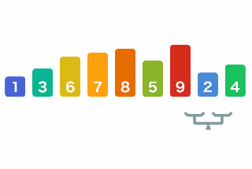

# Bubble sort 🫧

## Sommaire
1. [Français](#français)
2. [English](#english)

## Français
*Le tri à bulles est un algorithme de tri simple. Il fonctionne en comparant successivement des paires d'éléments adjacentes et en les échangeant s'ils sont dans le mauvais ordre. Ce processus est répété jusqu'à ce que le tableau soit trié.*

*Le tri à bulles est également connu sous le nom de tri par coulement ou tri par échange.*

##### Avantages :

- Simple à comprendre et à implémenter
- Les éléments égaux restent dans le même ordre

##### Inconvénients :

- Généralement pas très efficace pour un algorithme de tri

- Meilleur: `O(n)`

- Pire: `O (n ^ 2)`

## English

*Bubble sorting is a simple sorting algorithm. It works by repeatedly comparing pairs of adjacent elements and swapping them if they are in the wrong order. This process is repeated until the array is sorted.*

*Bubble sorting is also known as sinking sort, or exchange sort.*

##### Advantages:

- Simple to understand and implement
- Equal elements remain in the same order

##### Disadvantages:

- Generally not really efficient for a sorting algorithm
- Best: `O(n)`
- Worst: `O(n^2)`